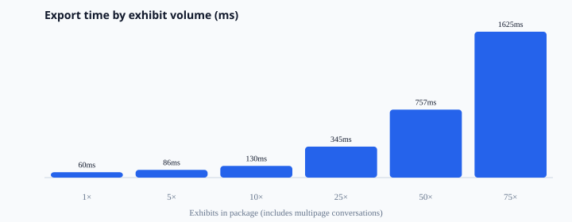
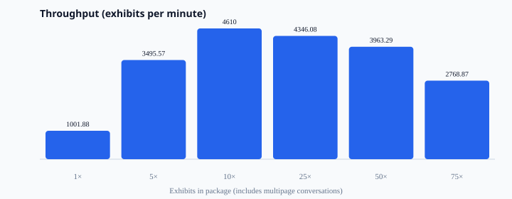

# ExhibitKit capacity benchmarks

Generated: 2026-09-18T04:36:48.897Z

## Results

| Scenario | Exhibits | Messages | Pages | Time (ms) | Exhibits/min | Messages/s | ZIP (bytes) | Heap Δ (MB) |
|----------|---------:|---------:|------:|----------:|-------------:|-----------:|------------:|------------:|
| 1 short | 1 | 25 | 4 | 60 | 1001.88 | 417.45 | 13453 | -1.78 |
| 5 mixed | 5 | 240 | 29 | 86 | 3495.57 | 2796.45 | 72956 | 7.8 |
| 10 mixed | 10 | 530 | 63 | 130 | 4610 | 4072.17 | 153134 | 1.17 |
| 25 mixed | 25 | 1500 | 175 | 345 | 4346.08 | 4346.08 | 413260 | 4.35 |
| 50 multipage-heavy | 50 | 4000 | 400 | 757 | 3963.29 | 5284.39 | 998124 | 28.32 |
| 75 stress | 75 | 7500 | 750 | 1625 | 2768.87 | 4614.78 | 1816526 | -33.23 |

## Charts

## Guidance

- Comfortable interactive: **≤ 25 exhibits**
- Recommended max interactive package: **≤ 75 exhibits**
- Multipage threshold: **≥ 40 messages**
- Export batch size: **10**

- Times are local PDF generation (Pro package with binder + ZIP), not network upload.
- Multipage exhibits use ≥40 messages and inflate page counts and binder merge time.
- For >75 exhibits, split into batches or export without a single combined binder.
